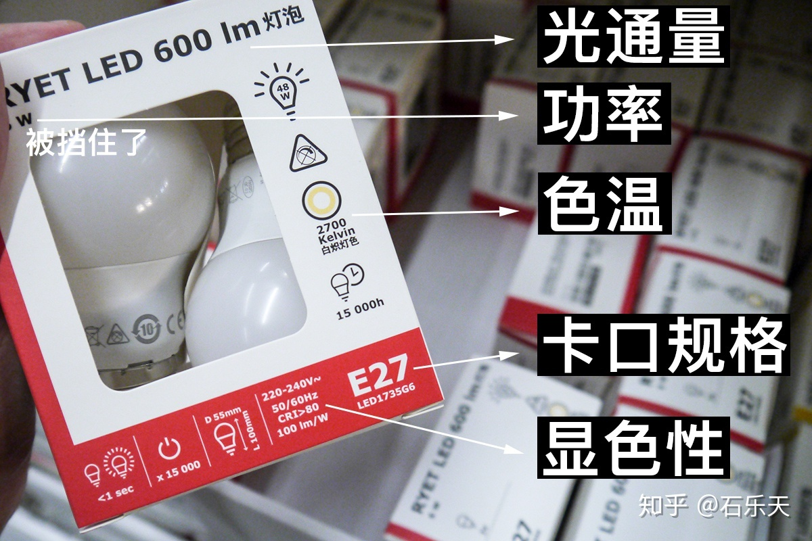

- 相关标准
	- GB7000.1-2015灯具 第1部分：一般要求与试验》
	- 《GB50034-2013建筑照明设计标准》
	- 《GB/T9473-2017读写作业台灯性能要求》
- 相关指标
	- 重点关注的指标：光通量、显色指数
	- 次要关注的指标：色温
	- 无需担心的指标：频闪、蓝光危害
	- LED注意事项：灯珠外露
	- 作为参考的指标：照明范围
-
- 灯泡商品外包装上的数值
	- 光通量
	- 功率
	- 色温
	- 卡口
	- 显色性
- {:height 383, :width 682}
- ## 光通量（单位：lm流明）
  collapsed:: true
	- 容易弄混一个概念：照度（单位： lx勒克斯）这个指的是照明的效果
	- 举个最简单的例子，一盏灯拿近了更亮，拿远了就不够亮了，灯本身的亮度（光通量）并没有改变，改变的是我们所接受到的照度。测试照度需要有专业的仪器。
	- 网上购买灯具时，光通量一般都是不标示的，一定要问卖、
	- 国标对办公阅读要求300lx的照度，精密制图则是750lx
	- 鉴于从光通量到照度的计算比较复杂，可以直接无脑买光通量300~500lm以上的台灯。
- ## 显色指数（CRI或Ra）
  collapsed:: true
	- 显色性越高的灯光下，物体的色彩越逼真。
	- 阳光的显色性是100，人造的灯具达不到那么高。
	- 在国标里，80的灯具就可以用在家里了，90已经适用于精密制图了。高于95的灯具就非常棒了，是商用专业级别的灯。
	- 检测显色性会分别考察15种颜色的还原度，按R1~R15分别打分，然后取平均值标识灯泡的性能，这个平均值就叫CRI。
	- CRI在不同地区会有不同的标准（比如有的不包括R9~R15），而Ra则特指R1~R8的平均值。
	- 也就是说CRI有可能等于Ra，也有可能超过Ra
	- 强调显色性的品牌，例如马歇尔“马灯”，会额外特别标明红色显色性R9的数值，方便更专业的人士参考。普通家用，参考包装盒上的CRI数值就已经足够。
	- 买灯时，CRI数值可以多多注意，因为大部分网店也不会明确标识。阅读工作灯泡最好还是选择90以上，价格并贵不了多少。
	- 以宜家的产品为例，39.9元的E27灯泡就是CRI＞90，而19.9元两个装的就是CRI＞80
- ## 色温（单位：K）
  collapsed:: true
	- 色温越高，灯光越冷；色温越低，灯光越暖。通常认为，暖光适合生活，白光适合工作
	- 家里建议用2700K~3000K色温的光线。国标中明确建议，4000K以上的色温不适合在夜晚使用。
- ## 频闪？
  collapsed:: true
	- “无频闪”是护眼灯主打的口号，不过这点和“无甲醛”一样很难成立。因为我们使用的是交流电，由此造成电灯都会有不同程度的闪烁。
	  国标中有相当复杂的算法，来计算什么是安全的频闪区间。除了频闪的频率之外，频闪时的亮度波动也会综合考虑进去。
	  也就是说，一盏有3C认证，符合国标要求的合格产品，频闪一定是合格的。
	- 国标里的低危闪烁频率是1250Hz，无危险频率是3152Hz，相当于灯光每1/3152秒就闪烁一次。
	- 而手机相机本身快门速度最快可达1/6000秒甚至更高，如果快门速度超过了频闪速度，频闪也会被相机记录下来。
	- 另外，根据国标的要求，即使灯光有闪烁，只要亮度波动在允许的范围内，也是合格的产品。而手机上的斑马纹无法准确地表达闪烁时的亮度波动数值。
- 关注光通量（300~500lm以上）、显色指数（CRI或Ra 80以上）、色温（2700K~4000K之间为佳）三个数值即可
- GB/T 9473-2017读写作业台灯性能要求
-
- ## 家用灯具功率
	- 电脑台灯 11W
	- 床头台灯 5W
	- 客厅led 21W
	- 客厅旧灯管 55W
	- 卧室飞利浦LED 10W
-