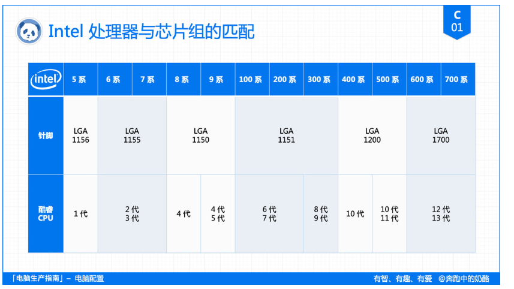
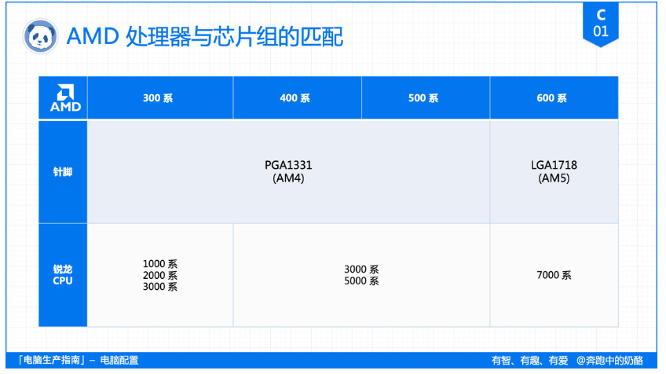
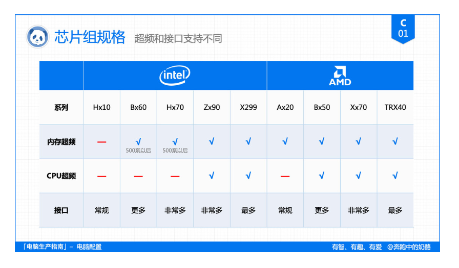
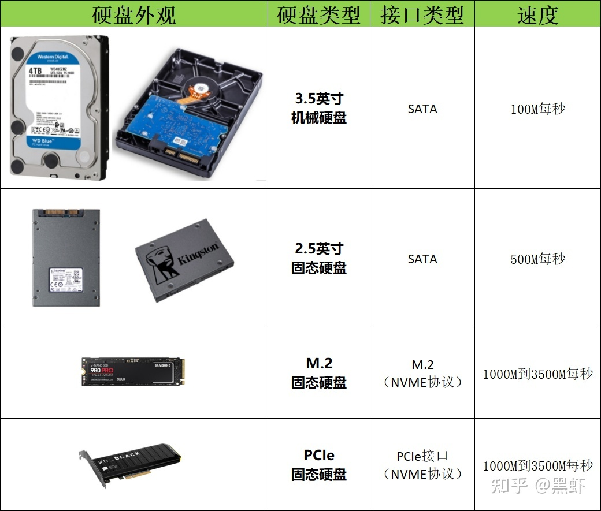
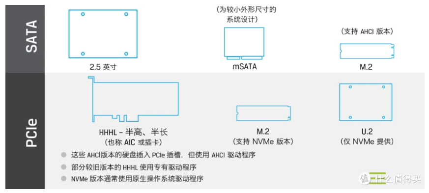

# CPU
collapsed:: true
	- ## Intel
	  collapsed:: true
		- i9-13**900**
		- i7-13**700**——13代i7
		- i3-12**100**——12代i3
		- i5-9**400**——9代i5
		- [[$red]]==i7—870——初代i7==
	- ## AMD
		- zen架构 速龙
		- 后三位子型号
		- R3 500
		- R5 500 600
		- R7 700 800
		- R9 900
		- 第一位数字
		- 代数:1000 2000 3000 5000 7000 9000
		- ZEN架构 ZEN+架构 ZEN2架构 ZEN3架构 ZEN4架构
	- ### 后缀部分
	  collapsed:: true
		- 台式机处理器部分
		- 后缀+X至高性能处理器;AMD则将其算作拥有更好超频性能
			- 后缀+E代表嵌入式工程级处理器；
			- 后缀+S代表低电压处理器；
			- 后缀+K代表不锁倍频处理器；
			  background-color:: yellow
			- 后缀+T代表超低电压处理器；
			  background-color:: yellow
			- 后缀+P代表屏蔽集显处理器；
			- 后缀+C代表集显强的处理器；
			- 后缀+R代表超强集显处理器
			- 后缀+G代表此CPU拥有AMD核心显卡（2018年新添加）
			- 后缀+GE代表AMD带核显的低功耗处理器（2019年新添加）
			- 后缀+F代表屏蔽/**没有**核心显卡的处理器（2019年新添加）
			  background-color:: yellow
		- 笔记本处理器部分
			- 后缀+ M代表标准电压处理器；
			- 后缀+ U代表低电压处理器；
			- 后缀+ H高电压且不可拆卸处理器；
			- 后缀+ X代表高性能处理器；
			- 后缀+ Q代表4核心至高性能处理器；
			- 后缀+ Y代表超低电压处理器。
- # 主板
  collapsed:: true
	- 主板芯片组命名规则:
	- ## <ins>Intel</ins>
		- 芯片组分可为 **H、B、Z、X** 四个等级。
		- 与之搭配的数字型号是 1、6、9，也就是 **Hx10、Bx60、Zx90**，还有就是顶级平台 X299
		- 为了**避免重名**，Intel 从 **300** 系以后，**B** 系列数字就从 **5 改成了 6**，**Z** 系列从 **7 改成了 9**，也就变成了 **1、6、9**
		- Z：高端级，主流桌面最高型号，支持超频等各种特性，一般搭配后缀K、KF的处理器，i9/i7为主。
		- B：主流级，不支持超频(最新B560开放内存超频)，一般搭配后缀F或者不带后缀的处理器，i5/i3为主。
		- H：又分为两种，一是Hx10，入门级，不支持超频，一般搭配后缀F或者不带后缀的处理器，i3/奔腾/赛扬为主。
		- {:height 326, :width 638}
	-
	-
	- ## <ins>AMD</ins>
		- 可分为 **A、B、X、TRX** 四个等级
		- 与之搭配的数字型号是 **2、5、7**，也就是 **Ax20、Bx50、Xx70**，还有就是顶级平台 **TRX40**
		- AMD芯片组分为三个等级，从高到低分别是==X、B、A==。
		- X：专业级或者发烧级，支持超频等各种特性，又分为两种，一是X399、TRX40这种，搭配线程撕裂者家族，二是Xx70系列，一般搭配后缀X的处理器，锐龙9/7为主。
		- B：主流级，支持超频，一般搭配锐龙7/5/3。
		- A：入门级，不支持超频，一般搭配锐龙3、速龙。
		-
			- {:height 306, :width 602}
	-
	- 接口
	- 
- # 显卡
  collapsed:: true
	- NVIDIA（英伟达），采“N卡”
	  collapsed:: true
		- GeForce：是NVIDIA显卡里的一个系列，类似CPU的“酷睿”、“锐龙”
		- RTX：20代的显卡前缀全是RTX，
		- 10代和16代的显卡除了GT1030 外都是GTX，过
		- 去还有GTS和GS，是用来代表档次的，类似CPU的“i9”、“i5”。
		-
		- “2080”
		  20：代数，也就是第几代产品，目前NVIDIA GeForce系列里20是最新的；
		  8： 等级，表示该显卡在同代显卡中的级别，数字越大，显卡的定位越高端；
		  0： 在第5代显卡中，这一位数字是5的话，就代表是加强版；从第6代开始，这一位数字几乎都是0，可以当作无意义。
		  后缀：“Ti”
		  Ti：表示加强版；
		  Super：也表示加强版，性能介于TI和无后缀之间。
	- AMD（美国超威半导体），“A卡”
	  collapsed:: true
		- 以“**Radeon RX 5700 XT**”为例说明：
		- **前缀：**“Radeon RX”
		- Radeon：是AMD显卡里的一个大系列；
		- RX：从500系列开始，AMD显卡前缀不论级别，前缀统一是RX；
		- **数字**“5700
		- “5”：在“5700”这张卡里表示5000系列，如果是“570”就代表500系列；“700”：在这个系列显卡中的定位，同系列同后缀的情况下，越高越好；
		- **后缀：**“XT”
		- ”XT“：表示加强版AMD也会给他家的顶级版显卡用特殊的方式命名，如：2017年发布的Vega系列2019年发布的Radeon VII
	-
- # 电源
  collapsed:: true
	- 额定功率
	- FPU、furmark 看功耗测评
	- 内存 12w
	- 固态 6w
	- 机械 10w
	- 主板 30w
	- 风扇 4w
	- 余量 100w
- # 硬盘
  collapsed:: true
	- 总线
		- SATA、==PCIe==、SAS
	- 协议
		- IDE、==NVMe==、AHCI
	- 接口
		- ==SATA==、mSATA、==M.2==、==PCIe==
	- PCIe:无线网卡 有线网卡 声卡 采集卡 转接卡
	- {:height 443, :width 509}
	- 固态硬盘也分为常见的为2.5寸的固态硬盘
	- 和M.2接口的长条硬盘，
	- 目前主流的是M.2 的长条硬盘，一般支持NVME协议，读写速度一般在2000M每秒，高的能达到3500M每秒。
	- SATA口的固态硬盘上限也才500M每秒。有接近7倍的差距，所以买硬盘时一定认准M.2接口，支持NVME协议的硬盘。如果不支持NVME协议，M.2接口但走SATA总线，速度还是最高500M每秒，所以要同时满足M.2接口和支持NVME协议才行。
	- 目前还有“PCIe4.0固态硬盘”，形态和M.2接口的形态是一样的，不过速度可达5000M每秒，但需要CPU和主板的支持，现在X570主板、B550主板和B560、Z590主板支持PCIe4.0固态硬盘。此外，PCIe5.0固态会在2021年末陆续进入市场。
	- 最下面的PCIe接口的固态硬盘，不太常见，速度上对比M.2接口的固态硬盘也没有什么优势，还要占用一个PCIe插槽，所以不必太关注。
	- 还有一些其他接口的固态硬盘，如mSATA，U.2,接口的固态硬盘，要么快淘汰了，要么民用基本见不到，所以这里不做讨论。
	- 
	- 关于品牌选择：目前世界能生产靠谱稳定存储颗粒的就那么几家，建议选择他们品牌的固态硬盘产品，他们分别是：三星、英特尔、西部数据（闪迪）、铠侠（原东芝存储）、镁光（英睿达）、海力士、中国长江存储。这些品牌因为自己有生产能力，一般最好的存储颗粒都是供给自己的，所以建议选择这些品牌，其他品牌因为自己没有生产能力，都是采购他们的颗粒然后做包装的，所以不建议作为第一选择。在这些品牌中购买，品质有保障，闭着眼睛买。
		- 系统盘主要推荐三星（三星颗粒）、西数（闪迪颗粒）、致钛（长江存储颗粒）、SOLIDIGM（海力士颗粒）、铠侠（东芝颗粒）、英睿达（美光颗粒）等颗粒大厂自有品牌，以及金士顿、宏碁、雷克沙等使用大厂原片或者自行封装的产品。
	- 看不到的技术层面，厂商为了提升固态容量，从SLC（单层单元）MLC（多层单元）TLC（三层单元）发展到了QLC（四层单元），容量越来越大，性能和寿命也越来越差，目前市场上，基本是TLC的固态硬盘一统天下了，所以作为消费者基本没的选，不过好在对于普通用户来讲，也用不出来啥区别。另外MLC又贵的一批，所以普通用户可以忽略，追求极致的可以选择MLC固态。
	- 颗粒
		- **SLC（Single-Level Cell）**最好，不过基本不民用，一般是军用或商用，市面上几乎没有卖；
		- **MLC（Multi-Level-Cell）**仅次于SLC，一般企业或有特殊需求者（如挖矿等）用的比较多，前两年市面上还有卖，但今年已经不常见了，且价格非常高；
		- **TLC（Triple-Level-Cell）**是现在的主流，其每个cell单元存储3bit信息，容量比MLC增加1/3，成本更低，但是架构更复杂，P/E编程时间长，寿命相对MLC也更短，但通常来讲，经过重度测试的TLC颗粒正常使用5年以上是没有问题的。另外现在的TLC固态硬盘都启用了SLC Cache缓存模式提升写入速度，使得在特定场合下，与MLC写入速度相差不大。
		- **QLC（Quali-Level-Cell）**自去年开始，QLC的市场份额就在不断增加，今年预计会占到市场产能的1/3左右，NAND厂商目前对QLC闪存的定位是全方位**取代SATA接口的固态硬盘，**以大容量，传输速度更快且成本更低廉的QLC固态硬盘来淘汰传统SATA接口硬盘，取代老式固态硬盘的市场份额。
		- **结论：从性能来看SLC＞MLC＞TLC＞QLC，但日常使用无论是办公还是游戏，TLC一般都足够了，追求极致性价比的可考虑入QLC，同容量M.2接口QLC固态价格比SATA固态反而更便宜，但速度却快了2倍以上，非常划算。**
- # 内存
  collapsed:: true
	- ddr4
	- 3200Mhz
	- 16g
	- 内存颗粒
		- 三星、镁光、海力士、长鑫
	- 品牌
		- 金士頓(Kingston)、威刚(ADATA)、三星（SAMSUNG）、芝奇(G.SKILL)、海盗船(Corsair)、十铨(Team)、镁光(Micron Crucial)、科赋(KLEVV)、阿斯加特（Asgard）、光威（gloway）、影驰
- # 显示器
  collapsed:: true
	- ## 尺寸
	  collapsed:: true
		-
		- 24、==27==、32寸 16：9
		- 30、34寸     21:9
	- ## 分辨率
	  collapsed:: true
		- 1080P 1920*1080
		- 2K 2560*1440
		- 4K 3840*2160
		- PPI
	- 24寸 1080P或2K
	- 27或32寸 2K或4K
	- ## 色域
	  collapsed:: true
		- 办公sRGB/平面创造adobeRGB/视频游戏DCI-P3
	- 色深
	  collapsed:: true
		- 办公6bit/影音8bit
	- 刷新率
		- 办公60hz/3A玩家 144Hz以下
	- ## 屏幕
	- 显示器面板
		- TN屏 便宜 响应时间快 对比度差颜色差
		- VN屏 可曲面屏 响应时间长
		- IPS屏 均衡 价格稍高
	- 背光板
		-
	- ## 接口
		- HDMI 数字信号 音频传输
			- 2.0
			-
		- DP 数字信号 热插拔 音频传输
			- 1.4 32.4 Gbit/s
			- 2.0 80 Gbit/s(暂无)
		- VGA 模拟信号
			- 最大分辨率:2048*1538
			- 最大刷新率:70Hz
		- DVI 数字信号/模拟信号 部分音频传输
			- 2K 60Hz
			- 1080P 120Hz
			- DVI-A、DVI-D、DVI-I
		- USB-C
-
- # [[USB接口]]
  collapsed:: true
	- ## Type-A
		- mini B
		- Micro B
		- 2.0 4金属触点
		- 3.0 9金属触点
	- ## Type-B
	- mini B
	- Micro B
	- ## Type-C
		- 兼容USB 2.0、3.0、USB4、雷电3/4
		- 100W供电、外界显卡显示器
		- 需注意为全功能type-c数据线
	- ## USB版本
		- USB 2.0
			- 192KB/s -1.5MB/s -60 MB/s
			- 最大传输速率为：480Mbps，相当于60 MB/s
		- USB 3.2
			- 3.2 GEN1 640MB/s 5Gbps
			- 3.2 GEN2 1200MB/s
			- 3.2 GEN2*2 2560MB/s
		- USB 4
			- 40Gbps
			- 20Gbps
			- 兼容雷电3(支持DP、PCIE3.0*4)
			-
-
- # [[配置表]]
  collapsed:: true
	- ## {{renderer :luckysheet, 配置清单1@1718376854167}}
-
- # 装系统相关
  id:: 66803f8c-e788-4ed7-a0e5-182dffe9394e
	- ## 安装驱动
	- 主要需要安装的是主板驱动，[显卡驱动](https://so.csdn.net/so/search?q=%E6%98%BE%E5%8D%A1%E9%A9%B1%E5%8A%A8&spm=1001.2101.3001.7020)，声卡驱动，网卡驱动，
	- 前两个你在重装系统的时候一般会自带有，但是这可能无法将你的电脑性能发挥到极致，因为不是最合适的驱动，使用第三方软件，如驱动精灵下载驱动很方便，但是可能会造成各种各样的问题，所以最好的方式是从官网下载驱动。
	- ## 修改下载及安装路径
		- ### 修改默认下载路径
			- 找到下载，右键属性-位置-移动，选择d盘或者其他盘，应用
		- ### 默认安装路径
			- win+R 输入regedit 找到下面的路径
			  HKEY_LOCAL_MACHINE\SOFTWARE\Microsoft\Windows\CurrentVersion
			  修改这个文件的数值，修改成你要设置成的默认文件夹
	- ## 装软件
	-
-
-